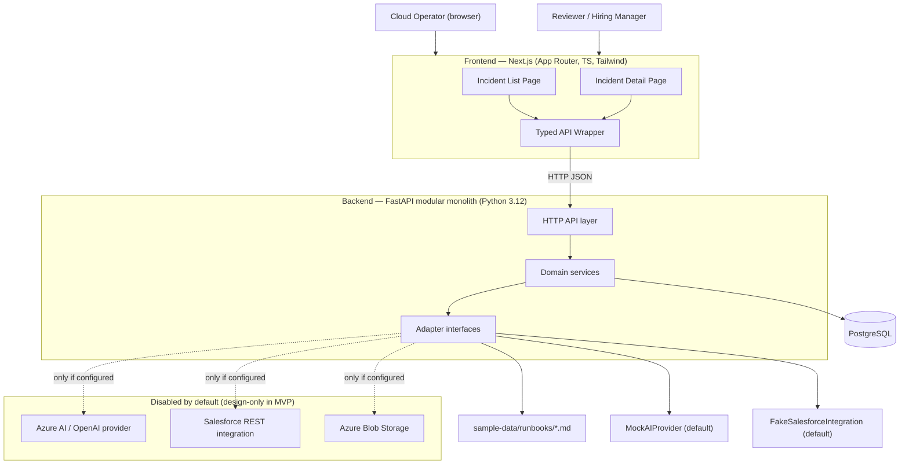
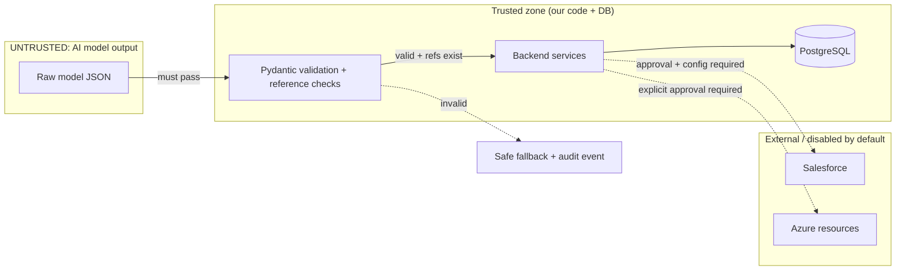
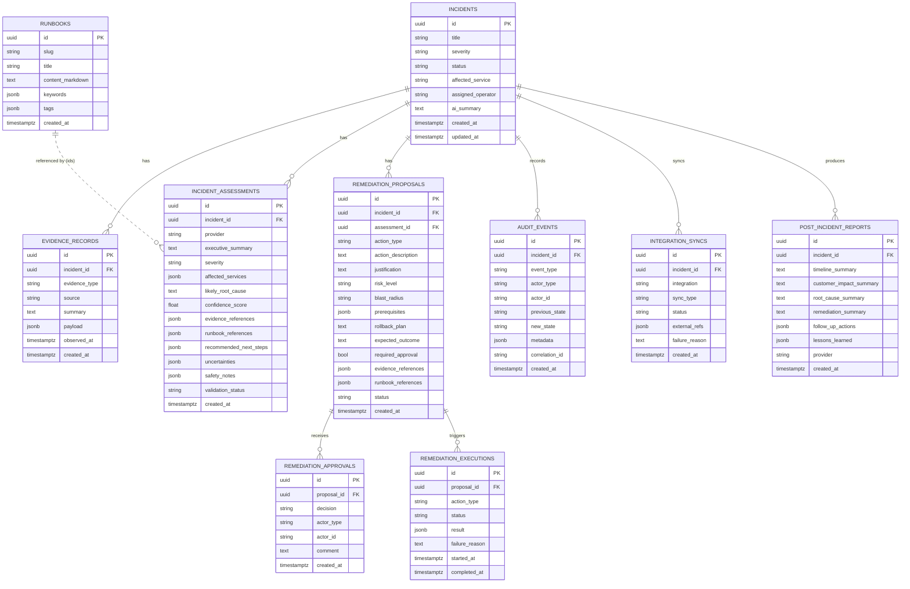
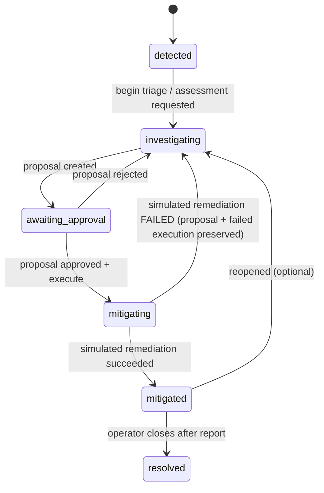
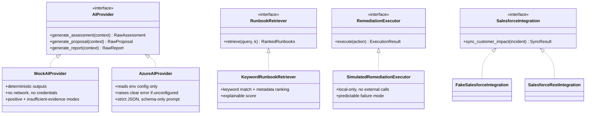

# AegisOps — Design Specification (Phase 1, Approved)

**Human-Governed AI Incident Response for Cloud Operations**

Status: APPROVED. Design/documentation only. No application code is implied by this document.

Locked defaults:
- Seed data: 1 fully-detailed Checkout API incident + 2 simpler filler incidents.
- Simulated failure: incident returns to `investigating`; proposal + failed execution preserved; emit `simulated_remediation_started` + `simulated_remediation_failed`; UI shows mitigation failed.
- License: MIT.
- Package managers: frontend `npm`; backend `pip` + pinned `pyproject.toml`.

---

## 1. Architecture overview

AegisOps is a **modular monolith**: one FastAPI backend process with clear internal domain modules, and one Next.js frontend. No microservices, no message brokers, no service mesh. Domains communicate via in-process service calls.

**Why a modular monolith:**
- One repo, one backend process → trivially runnable locally with `docker compose`.
- Clear domain boundaries give the readability of services without the operational cost.
- Adapter interfaces at the edges (AI, retrieval, executor, storage, Salesforce) isolate the parts most likely to change. Swapping Mock→Azure or Fake→REST is a config + implementation change, not an architecture change.

### 1.1 Layered structure (per domain)
```
domain/
  router.py      # FastAPI routes (HTTP boundary, request/response models)
  service.py     # business logic + orchestration (no HTTP, no SQL details)
  repository.py  # data access via SQLAlchemy (no business rules)
  schemas.py     # Pydantic v2 request/response/domain models
  models.py      # SQLAlchemy ORM models
```
Dependency direction: **router → service → repository**. Services depend on adapter interfaces, never concrete implementations; concrete adapters are injected via a composition root (`shared/container.py`) driven by environment config.

### 1.2 System context diagram


### 1.3 Trust boundaries


Boundary rules:
- **AI output is untrusted.** It enters the trusted zone only after strict schema validation and reference-existence checks. Failure → safe fallback + `assessment_validation_failed`.
- **Remediation never leaves the trusted zone.** Only `SimulatedRemediationExecutor` exists; it writes only to our DB.
- **External systems** (real Salesforce, Azure) require configuration and explicit human approval, and are absent from the default runtime path.

---

## 2. Repository structure

```
AegisOps/
├── README.md
├── LICENSE                     # MIT
├── .gitignore
├── .env.example                # top-level compose env (placeholders only)
├── docker-compose.yml
│
├── frontend/
│   ├── package.json / package-lock.json
│   ├── tsconfig.json / next.config.mjs / tailwind.config.ts / postcss.config.mjs
│   ├── .env.example / Dockerfile / eslint.config.mjs
│   ├── public/
│   └── src/
│       ├── app/
│       │   ├── layout.tsx / page.tsx (redirect → /incidents)
│       │   ├── incidents/page.tsx            # list
│       │   ├── incidents/[id]/page.tsx       # detail
│       │   ├── loading.tsx / error.tsx / not-found.tsx / globals.css
│       ├── components/
│       │   ├── incidents/ evidence/ ai/ remediation/ audit/ report/ salesforce/ ui/
│       ├── lib/
│       │   ├── api/ (client.ts + endpoints)
│       │   ├── types.ts / format.ts
│       └── __tests__/
│
├── backend/
│   ├── pyproject.toml / requirements-pinned.txt / .env.example / Dockerfile
│   ├── alembic.ini / migrations/
│   ├── seed/seed_data.py
│   ├── tests/ (unit/ integration/)
│   └── app/
│       ├── main.py / config.py
│       ├── domains/
│       │   ├── incidents/ evidence/ runbooks/(+retrieval/) ai/ remediation/ approvals/ audit/
│       │   └── integrations/salesforce/
│       └── shared/ (db, container, logging, telemetry, correlation, errors, enums)
│
├── infra/ (main.bicep, modules/, main.parameters.example.json)   # placeholders only
├── docs/ (architecture, azure-deployment, salesforce-integration, demo-script, interview-talking-points, ai-development-process)
├── sample-data/ (runbooks/*.md, incidents/ fixtures)
├── .github/workflows/ci.yml
└── .kiro/ (specs/, steering/)
```

---

## 3. Database schema

PostgreSQL + SQLAlchemy + Alembic. UUID PKs, `timestamptz` (UTC), `JSONB` payload/metadata.

### 3.1 ER diagram


### 3.2 Enumerations (DB-checked + Python enums)
- severity: sev1, sev2, sev3, sev4
- incident.status: detected, investigating, awaiting_approval, mitigating, mitigated, resolved
- evidence_type: alert, metric, log, deployment, runbook, operator_note
- proposal.status: pending, approved, rejected, executing, executed, failed
- approval.decision: approved, rejected
- execution.status: started, succeeded, failed
- action_type: rollback_deployment, disable_feature_flag, scale_service
- assessment.validation_status: valid, invalid_fallback
- audit.event_type: incident_created, evidence_added, assessment_requested, assessment_generated, assessment_validation_failed, remediation_proposed, approval_requested, remediation_approved, remediation_rejected, simulated_remediation_started, simulated_remediation_completed, simulated_remediation_failed, post_incident_report_generated, salesforce_sync_requested, salesforce_sync_completed, salesforce_sync_failed
- integration_syncs.status: requested, completed, failed

### 3.3 Append-only audit design
- `AuditRepository` exposes only `append(...)` and read methods. No update/delete.
- Documented DB-level hardening (docs, not enforced in MVP local dev): a trigger/role blocking UPDATE/DELETE on `audit_events`. In MVP, enforced at the application layer + tested that no mutation API exists.
- Documented as a **portfolio demonstration of append-only auditing, not a compliance-certified logging system.**

---

## 4. Backend API routes

All under `/api/v1`. Correlation ID via middleware. Errors: `{ error: { code, message, correlation_id } }`.

| Method | Path | Purpose | Emits audit |
|---|---|---|---|
| GET | `/health` | Liveness/readiness | — |
| GET | `/api/v1/incidents` | List; `?status=&severity=` | — |
| GET | `/api/v1/incidents/{id}` | Detail with nested relations | — |
| GET | `/api/v1/incidents/{id}/evidence` | Evidence; `?type=` | — |
| GET | `/api/v1/incidents/{id}/audit` | Append-only audit timeline | — |
| GET | `/api/v1/runbooks` | List runbooks | — |
| GET | `/api/v1/runbooks/{id}` | Runbook detail | — |
| POST | `/api/v1/incidents/{id}/assess` | Run AI assessment | assessment_requested, assessment_generated \| assessment_validation_failed |
| GET | `/api/v1/incidents/{id}/assessment` | Latest assessment | — |
| POST | `/api/v1/incidents/{id}/proposals` | Generate proposal | remediation_proposed, approval_requested |
| GET | `/api/v1/incidents/{id}/proposals` | List proposals | — |
| POST | `/api/v1/proposals/{id}/approve` | Approve (optional comment) | remediation_approved |
| POST | `/api/v1/proposals/{id}/reject` | Reject → investigating | remediation_rejected |
| POST | `/api/v1/proposals/{id}/execute` | Simulated remediation (requires approval) | simulated_remediation_started, simulated_remediation_completed \| simulated_remediation_failed |
| GET | `/api/v1/proposals/{id}/execution` | Execution status/result | — |
| POST | `/api/v1/incidents/{id}/report` | Generate report (only after mitigated) | post_incident_report_generated |
| GET | `/api/v1/incidents/{id}/report` | Fetch report | — |
| POST | `/api/v1/incidents/{id}/salesforce-sync` | Manual fake Salesforce sync | salesforce_sync_requested, salesforce_sync_completed \| salesforce_sync_failed |
| GET | `/api/v1/incidents/{id}/integration-syncs` | List sync attempts/results | — |

Server-side guards:
- `execute` → 409/422 if no prior `approved` approval; no execution row created (AC-18).
- `report` → 409 if incident not `mitigated` (AC-23).
- Invalid transitions → domain error → 409, state unchanged (AC-7).

OpenAPI at `/docs` and `/openapi.json`; frontend types mirror these.

---

## 5. Frontend pages & components

### 5.1 Pages
- `/` → redirect to `/incidents`.
- `/incidents` — Incident List: title, severity, status, affected service, created/updated, assigned operator, short AI summary; status + severity filters; card grid (mobile) / table (desktop); loading/empty/error states.
- `/incidents/[id]` — Incident Detail, sections: header; summary; evidence timeline + type filter (expandable items); AI assessment (summary, root cause, confidence meter, next steps, uncertainties, safety notes, clickable citations); remediation proposal card; approval controls (when pending); execution status (failure banner on failure); post-incident report (after mitigation); Salesforce sync panel (fake IDs/URLs + history); append-only audit timeline.

### 5.2 Interaction flow (frontend → backend)
```mermaid
sequenceDiagram
  actor Op as Operator
  participant UI as Next.js UI
  participant API as FastAPI
  participant DB as PostgreSQL
  participant AI as MockAIProvider
  participant EX as SimulatedExecutor

  Op->>UI: Open incident detail
  UI->>API: GET /incidents/{id}
  API->>DB: load incident + relations
  API-->>UI: incident detail JSON

  Op->>UI: Run AI analysis
  UI->>API: POST /incidents/{id}/assess
  API->>DB: audit: assessment_requested
  API->>AI: assess(evidence, runbooks)
  AI-->>API: raw structured output
  API->>API: validate schema + refs exist
  alt valid
    API->>DB: save assessment; audit: assessment_generated
  else invalid
    API->>DB: safe fallback; audit: assessment_validation_failed
  end
  API-->>UI: assessment (with citations)

  Op->>UI: Generate proposal
  UI->>API: POST /incidents/{id}/proposals
  API->>DB: proposal(pending); state→awaiting_approval; audit: remediation_proposed, approval_requested
  API-->>UI: proposal

  Op->>UI: Approve (comment)
  UI->>API: POST /proposals/{id}/approve
  API->>DB: approval(approved); audit: remediation_approved
  API-->>UI: approved

  Op->>UI: Execute (simulated)
  UI->>API: POST /proposals/{id}/execute
  API->>DB: guard: approval exists?; state→mitigating; audit: simulated_remediation_started
  API->>EX: simulate(action_type)
  alt success
    EX-->>API: succeeded
    API->>DB: execution succeeded; state→mitigated; audit: simulated_remediation_completed
  else failure
    EX-->>API: failed
    API->>DB: execution failed; state→investigating; audit: simulated_remediation_failed
  end
  API-->>UI: execution result
```

### 5.3 Typed API wrapper
Single `lib/api/` module exposing typed functions (`getIncidents`, `getIncident`, `assessIncident`, `createProposal`, `approveProposal`, `rejectProposal`, `executeProposal`, `generateReport`, `syncSalesforce`, ...). Central error handling maps the backend error shape to typed results. Types in `lib/types.ts` mirror backend Pydantic schemas.

---

## 6. State transitions

### 6.1 Incident state machine

Invalid transitions are rejected at the service layer with no DB change.

### 6.2 Proposal status machine
```mermaid
stateDiagram-v2
  [*] --> pending
  pending --> approved: approve
  pending --> rejected: reject
  approved --> executing: execute (simulated)
  executing --> executed: success
  executing --> failed: failure
  failed --> pending: (proposal preserved; may be re-approved/re-run per design)
```
On simulated failure: incident → `investigating`, proposal kept, failed execution row kept, audit `simulated_remediation_started` + `simulated_remediation_failed`, UI failure banner.

---

## 7. AI provider design

### 7.1 Interfaces & selection

Composition root (`shared/container.py`) selects adapters from env:
- `AI_PROVIDER=mock` (default) → MockAIProvider. `AI_PROVIDER=azure` → AzureAIProvider (requires endpoint/deployment/key vars; clear error if missing).
- `SALESFORCE_ENABLED=false` (default) → FakeSalesforceIntegration. Real REST only when explicitly enabled + configured.

### 7.2 Validation pipeline (untrusted → trusted)
1. Provider returns raw text/JSON.
2. Parse to strict Pydantic v2 model (extra fields forbidden, types enforced, `confidence_score` in [0,1]).
3. Reference check: every `evidence_references` and `runbook_references` id must exist in the DB for this incident/corpus. Unknown id → failure.
4. On failure: build a safe fallback (conservative "insufficient evidence / manual review required"), set `validation_status=invalid_fallback`, emit `assessment_validation_failed`. Never surface raw sensitive output; never leak secrets.
5. On success: persist, set `validation_status=valid`, emit `assessment_generated`.

### 7.3 Real-provider prompt contract (AzureAIProvider only)
System prompt mandates: use only supplied evidence/runbooks; never invent evidence/runbook IDs; explicitly state insufficiency; do not recommend real external execution; all remediation requires human approval; return JSON only; follow the schema exactly. Evidence + retrieved runbooks are the only grounding context.

### 7.4 MockAIProvider determinism
Given the fixed seed incident, the mock returns hard-wired, schema-valid content referencing real seeded evidence/runbook IDs. An "insufficient-evidence" mode returns low confidence + populated `uncertainties`. No timestamps/random values in the output path → repeatable across runs.

### 7.5 Runbook retrieval (deterministic, MVP)
Keyword match over runbook `keywords`/`tags`/title/content + metadata ranking (service/tag weighting). Returns ranked runbooks with an inspectable numeric score and matched terms. Behind `RunbookRetriever` so a future `VectorRunbookRetriever` drops in without changing the AI workflow. No vector DB in MVP.

---

## 8. Local Docker workflow

`docker-compose.yml` services:
- `db`: postgres:16, data volume, healthcheck.
- `backend`: FastAPI (uvicorn), depends_on db healthy, runs migrations + seed on start (idempotent), `AI_PROVIDER=mock`, `SALESFORCE_ENABLED=false`.
- `frontend`: Next.js dev server, `NEXT_PUBLIC_API_BASE_URL` → backend.

`.env.example` at root/frontend/backend with placeholders only. Local run requires no Azure, AI, or Salesforce credentials (NFR-1).

---

## 9. Test strategy

**Backend unit (pytest):** retrieval ranking + determinism (AC-11); state-machine transitions incl. invalid rejection (AC-7) and failure→investigating; AI schema validation incl. bounds + extra-field rejection (AC-12); invalid-output fallback + audit (AC-14); evidence/runbook reference validation; proposal creation (AC-16); approval + audit (AC-17); rejection → investigating (AC-17); execute-without-approval blocked (AC-18); simulation success → mitigated (AC-19); predictable failure → investigating, no external calls (AC-20); append-only audit (AC-21); fake Salesforce adapter + audit (AC-24); REST skeleton disabled; Azure config error (AC-15).

**Backend integration (pytest + TestClient, ephemeral Postgres):** list filtering (AC-5); nested detail (AC-6); full demo sequence audit set (AC-22); report gating (AC-23).

**Frontend:** `tsc --noEmit` (AC-26); ESLint (AC-26); component/integration tests for filters, loading/empty/error states (AC-8/AC-9), citation links resolving (AC-10).

**Determinism:** fixed seed + mock provider → stable snapshot assertions (NFR-2).

**Build/CI gates:** Docker builds (AC-27); CI workflow with disabled/manual Azure deploy job (AC-28); Bicep + secret/id scan (AC-29); docs match behavior (AC-30).

---

## 10. Phased Azure & Salesforce plan (design-only in MVP)

- **Azure (Milestone 8 artifacts; deploy only at Milestone 9 with explicit approval):** Bicep placeholders for ACR, Container Apps env + 2 apps, Key Vault, Log Analytics, App Insights, Storage + Blob, PostgreSQL params/boundary, managed identity. `azure-deployment.md` with placeholder commands, cost-awareness, teardown, "not deployed until approved" reminder.
- **Salesforce (Milestone 7):** fake adapter functional locally; REST skeleton disabled; `salesforce-integration.md` covers object model, External Services/OpenAPI approach, least-privilege permissions, why manual approval, fake→real switch, limitations.

Both stay off the default runtime path and off the network unless explicitly enabled + approved.
