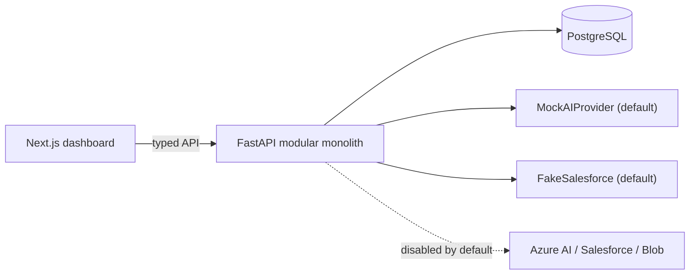

# AegisOps

**Human-Governed AI Incident Response for Cloud Operations**

AegisOps is an Azure-ready, full-stack AI incident-response platform. It helps a
cloud operator investigate a simulated incident by bringing together alerts,
metrics, logs, deployment history, and operational runbooks; produces an
evidence-grounded assessment; proposes a safe remediation plan; requires a
human to approve or reject it; simulates the approved action; and records a
complete, append-only audit trail.

> Uses **synthetic data only**. Every remediation is **simulated** and requires
> **explicit human approval**. The base app contacts **no real** Azure,
> Salesforce, email, Slack, or deployment systems.

## 1. Product overview

AegisOps is an operational workflow product — not a chatbot. It has a real
dashboard, structured relational data, evidence citations, human approval
controls, auditability, tests, and a deployment-ready architecture. The primary
scenario is an e-commerce **Checkout API** incident where a new deployment
introduces a fault causing elevated checkout failures.

## 2. The business problem

During an incident, on-call operators juggle alerts, dashboards, logs, deploy
history, and runbooks across many tools under time pressure. AegisOps
consolidates that context, produces an evidence-grounded assessment, and
proposes a safe, reversible remediation — while keeping a human firmly in
control and recording everything for review.

## 3. What the demo proves

- AI workflow design with **evidence-grounded** outputs (citations to real IDs).
- Treating AI output as **untrusted**: strict validation before any use.
- Secure backend engineering, normalized data model, and migrations.
- Human-in-the-loop approval and **simulated-only** remediation.
- Append-only auditability of every meaningful event.
- Containerization, CI, and an Azure deployment architecture (as IaC placeholders).

## 4. Main features

- Incident dashboard with severity/status filters and responsive card/table views.
- Incident detail: evidence timeline (with type filter), AI assessment with
  clickable evidence citations, remediation proposal, approval controls,
  simulated execution status, post-incident report, fake Salesforce sync, and an
  append-only audit timeline.
- Deterministic runbook retrieval, a deterministic mock AI provider, and strict
  Pydantic validation of all AI output.

## 5. Safety and governance model

1. Synthetic data only. 2. No real production remediation. 3. Every remediation
is simulated and 4. requires explicit UI approval. 5. All AI output is treated
as untrusted and validated by strict Pydantic schemas before display/storage/
action. 6. AI may cite only evidence/runbook IDs that exist in the database;
invalid output falls back safely and is audited. 7. No secrets or cloud
identifiers are committed. 8. Append-only audit trail for all meaningful events.

The audit trail is a **portfolio demonstration** of append-only auditing, not a
compliance-certified logging system.

## 6. Architecture diagram

See [`docs/architecture.md`](docs/architecture.md) for the full system context,
data flow, trust boundaries, and workflow diagrams (Mermaid).



## 7. Technology stack

- **Frontend:** Next.js (App Router), TypeScript (strict), Tailwind CSS, Vitest.
- **Backend:** Python 3.12, FastAPI, Pydantic v2, SQLAlchemy 2, Alembic,
  PostgreSQL, pytest. Structured JSON logging with correlation IDs;
  OpenTelemetry-ready.
- **Dev/Deploy:** Docker, Docker Compose, GitHub Actions CI, Azure Bicep
  (placeholders).

## 8. Local setup

Prerequisites: Docker + Docker Compose, or local Node 20+ and Python 3.12 with
PostgreSQL 16.

```bash
cp .env.example .env
docker compose up --build
# Frontend: http://localhost:3000   Backend: http://localhost:8000
```

Backend without Docker:

```bash
cd backend
python3.12 -m venv .venv && source .venv/bin/activate
pip install -e ".[dev]"
# point POSTGRES_* at a local Postgres, then:
alembic upgrade head
python -m seed.seed_data
uvicorn app.main:app --reload
```

Frontend without Docker:

```bash
cd frontend
npm ci
npm run dev
```

## 9. How to run the synthetic incident demo

1. Open the dashboard and select the critical **Checkout API** incident.
2. Review the evidence timeline (alert, metric, log, deployment).
3. Run **AI analysis** — see an evidence-backed assessment with clickable citations.
4. Generate a remediation proposal (risk, blast radius, prerequisites, rollback).
5. **Approve** it, then **run simulated remediation** — the incident moves to
   `mitigated`.
6. Generate the **post-incident report** and, optionally, run the **fake
   Salesforce** sync.
7. Review the complete audit timeline.

The full flow is scripted in [`docs/demo-script.md`](docs/demo-script.md).

## 10. How MockAIProvider works

`MockAIProvider` is deterministic and requires no credentials. For the seeded
incident (which has a deployment plus corroborating log/metric evidence) it
returns a confident rollback assessment and proposal, citing only real seeded
IDs. When key evidence is withheld it returns a low-confidence,
insufficient-evidence result with populated uncertainties. It is the default
provider.

## 11. How to configure AzureAIProvider

Set `AI_PROVIDER=azure` and provide `AZURE_OPENAI_ENDPOINT`,
`AZURE_OPENAI_DEPLOYMENT`, `AZURE_OPENAI_API_VERSION`, and
`AZURE_OPENAI_API_KEY` via the environment or Key Vault (never committed). The
provider raises a clear error if configuration is incomplete. Its network
client is a documented extension point and is not wired to a live service in
this MVP.

## 12. Azure deployment overview

Design-only in this repo. See [`docs/azure-deployment.md`](docs/azure-deployment.md)
and the Bicep placeholders under `infra/`. Nothing is provisioned until
explicitly approved.

## 13. Salesforce integration overview

Optional and disabled by default. A `FakeSalesforceIntegration` returns
synthetic references locally; a `SalesforceRestIntegration` skeleton stays
disabled without configuration. See
[`docs/salesforce-integration.md`](docs/salesforce-integration.md).

## 14. Testing instructions

```bash
# Backend (needs a PostgreSQL reachable via POSTGRES_*; integration tests skip otherwise)
cd backend && pytest

# Frontend
cd frontend && npm run lint && npm run typecheck && npm test
```

## 15. Security considerations

- No secrets or cloud identifiers in source; `.env.example` uses placeholders.
- Production secret strategy: **Azure Key Vault + managed identity**.
- AI output is untrusted and strictly validated; safe fallback on failure.
- Remediation is simulated only; execution requires a prior human approval.
- Structured logs never include request bodies, headers, cookies, or credentials.

## 16. Known limitations

- Synthetic data only; the AzureAIProvider and SalesforceRestIntegration are
  skeletons (no live calls in the MVP).
- Single mock operator identity; no real authentication yet.
- Deterministic keyword runbook retrieval (no vector search yet).
- Audit trail is a demonstration, not a certified compliance log.

## 17. Future improvements

- Real Azure deployment (Bicep is ready as placeholders).
- Microsoft Entra ID authentication and RBAC.
- Vector-based runbook retrieval behind the existing interface.
- A live AzureAIProvider and a real SalesforceRestIntegration.

## 18. Portfolio / interview talking points

See [`docs/interview-talking-points.md`](docs/interview-talking-points.md).

## 19. Screenshots and demo video

_Add screenshots of the incident list and detail pages, and a 2–3 minute demo
video, here._

- `` _(placeholder)_
- `` _(placeholder)_

## 20. License

[MIT](LICENSE) © 2026 Peter Yousefi.

## Documentation

- [Requirements](.kiro/specs/aegisops/requirements.md) ·
  [Design](.kiro/specs/aegisops/design.md) ·
  [Tasks](.kiro/specs/aegisops/tasks.md)
- [Architecture](docs/architecture.md) ·
  [Azure deployment](docs/azure-deployment.md) ·
  [Salesforce integration](docs/salesforce-integration.md)
- [Demo script](docs/demo-script.md) ·
  [Interview talking points](docs/interview-talking-points.md) ·
  [AI development process](docs/ai-development-process.md)
