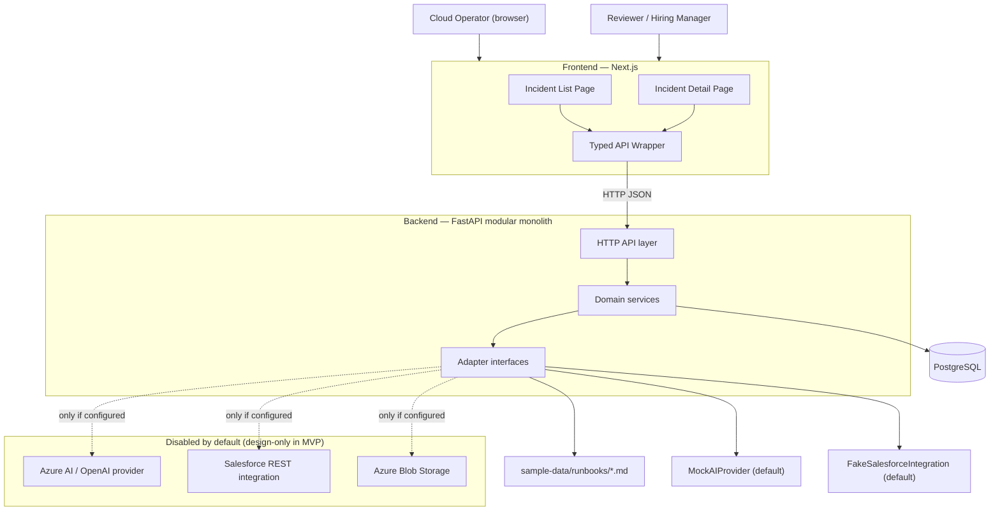
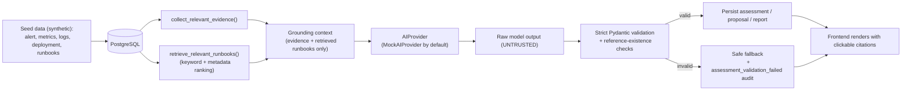
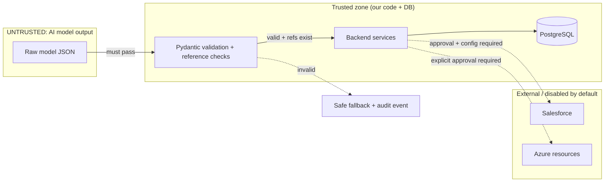
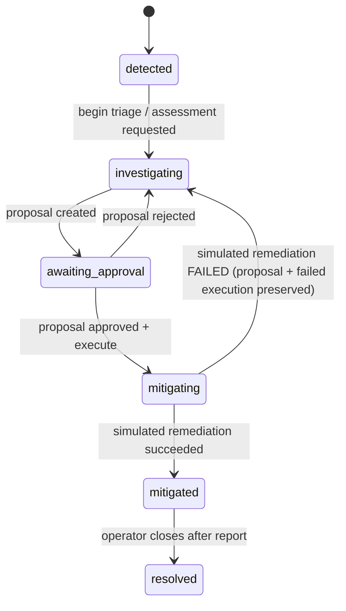

# AegisOps — Architecture

**Human-Governed AI Incident Response for Cloud Operations**

This document describes the system architecture, data flow, trust boundaries, and the AI / approval / audit workflows. It reflects the approved Phase 1 design. It is documentation; it does not deploy anything and does not connect to real Azure, AI, or Salesforce services.

---

## 1. System overview

AegisOps helps a cloud operator investigate a simulated incident by bringing together alerts, metrics, logs, deployment history, and operational runbooks. It produces an evidence-grounded incident assessment, proposes a safe remediation plan, requires a human to approve or reject that plan, simulates the approved action, and records a complete audit trail.

The system is a **modular monolith**:
- **Frontend** — Next.js (App Router, TypeScript, Tailwind). Two pages: incident list and incident detail. All backend calls go through a single typed API wrapper.
- **Backend** — FastAPI (Python 3.12, Pydantic v2, SQLAlchemy, Alembic) organized into domain modules (incidents, evidence, runbooks, ai, remediation, approvals, audit, integrations/salesforce, shared).
- **Database** — PostgreSQL.
- **Adapters** — interfaces for the AI provider, runbook retrieval, remediation executor, object storage, and Salesforce. Default runtime uses the deterministic `MockAIProvider` and the `FakeSalesforceIntegration`; real Azure/Salesforce paths are disabled by default.

Design goals: run entirely locally with synthetic data and no paid credentials; keep every remediation simulated; require explicit human approval; treat all AI output as untrusted.

### System context

---

## 2. Data flow

The primary demo is the e-commerce Checkout API incident: a new deployment introduces a fault causing elevated checkout failures.

Only retrieved evidence and retrieved runbooks are passed to the AI workflow. The AI never sees the full corpus and can only cite IDs that exist in the database.

---

## 3. Trust boundaries

- **AI output is untrusted** and enters the trusted zone only after strict schema validation and reference-existence checks.
- **Remediation never leaves the trusted zone**: only the `SimulatedRemediationExecutor` exists, and it writes only to the local database. No Azure/Kubernetes/shell/Terraform/Salesforce/real-API calls.
- **External systems** require both configuration and explicit human approval, and are absent from the default runtime path.
- **Secrets** are never hard-coded. Local config uses `.env.example` placeholders. Production strategy (documented, not provisioned) is Azure Key Vault + managed identity.

---

## 4. AI workflow

The AI workflow is explicit and non-autonomous. There are no uncontrolled agent loops. It is a sequence of functions:

- `triage_incident()` — determine severity signals from evidence.
- `collect_relevant_evidence()` — gather the incident's evidence records.
- `retrieve_relevant_runbooks()` — deterministic keyword + metadata ranking with an explainable score.
- `generate_incident_assessment()` — produce a schema-validated assessment.
- `generate_remediation_proposal()` — produce a schema-validated proposal (always requires approval).
- `generate_post_incident_report()` — produce a schema-validated report (only after mitigation).

Every output is validated with strict Pydantic v2 models and reference-existence checks before it is displayed, stored, or acted upon. On validation failure the system returns a safe fallback and records an `assessment_validation_failed` audit event; it never uses the raw output as a normal result and never leaks secrets or raw sensitive output.

The default provider is the deterministic `MockAIProvider` (no credentials, repeatable output, positive and insufficient-evidence modes). The `AzureAIProvider` is a configurable skeleton driven only by environment variables; it raises a clear error when unconfigured and is not connected to a live service in the MVP.

---

## 5. Approval workflow

Human approval is mandatory before any (simulated) remediation.

- A proposal begins as `pending` with `required_approval = true`.
- A mock operator approves or rejects with an optional comment.
- Approval records `remediation_approved` and advances the incident; rejection records `remediation_rejected` and returns the incident to `investigating`.
- Remediation cannot execute without a prior explicit approval (enforced server-side).
- On a simulated remediation failure, the incident returns to `investigating`, the proposal and the failed execution record are preserved, `simulated_remediation_started` and `simulated_remediation_failed` audit events are recorded, and the UI shows that mitigation failed and further investigation is required.

Supported simulated actions: `rollback_deployment`, `disable_feature_flag`, `scale_service`. The simulator updates only local demo data and supports a predictable failure mode for testing.

---

## 6. Audit workflow

All meaningful incident and approval events are written to an append-only `audit_events` table.

- The audit repository exposes only append and read operations — no update or delete.
- Recorded event types include: `incident_created`, `evidence_added`, `assessment_requested`, `assessment_generated`, `assessment_validation_failed`, `remediation_proposed`, `approval_requested`, `remediation_approved`, `remediation_rejected`, `simulated_remediation_started`, `simulated_remediation_completed`, `simulated_remediation_failed`, `post_incident_report_generated`, `salesforce_sync_requested`, `salesforce_sync_completed`, `salesforce_sync_failed`.
- Each event carries id, timestamp, actor type/identifier, event type, incident id, previous/new state where relevant, metadata, and a correlation id.

This audit trail is a **portfolio demonstration of append-only auditing**, not a compliance-certified logging system.

---

## 7. Azure deployment mapping (design-only)

The production architecture is designed and captured as Bicep placeholders under `infra/`. Nothing is provisioned or deployed until explicitly approved.

| Component | Azure service (target) |
|---|---|
| Frontend service | Azure Container Apps |
| Backend service | Azure Container Apps |
| Container images | Azure Container Registry |
| Database | Azure Database for PostgreSQL |
| Runbooks / artifacts | Azure Blob Storage |
| Secrets | Azure Key Vault |
| Identity | Microsoft Entra ID + managed identity |
| Observability | Azure Monitor + Application Insights |
| CI/CD | GitHub Actions |
| Infrastructure-as-code | Bicep templates (`infra/`) |

Details, placeholder commands, cost-awareness, and teardown guidance live in `docs/azure-deployment.md`. Real deployment is gated on explicit approval (Milestone 9).

---

## 8. Salesforce adapter boundary (design-only)

Salesforce is an optional adapter, disabled by default.

- `SalesforceIntegration` — interface.
- `FakeSalesforceIntegration` — works locally, returns fake external IDs/URLs.
- `SalesforceRestIntegration` — skeleton that stays disabled without explicit configuration.

The conceptual flow: an operator manually starts a customer-impact sync after approval; the adapter would create/update a Service Incident representation, a Customer Impact record, and a support Case; the UI shows returned external IDs/URLs. No customer emails and no mass communications are automated. Every sync attempt is audited. Real Salesforce writes require explicit configuration and approval. See `docs/salesforce-integration.md`.
